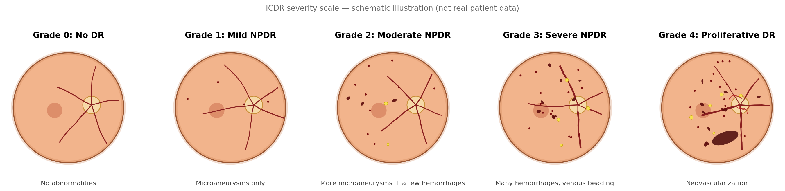

# Diabetic Retinopathy Grading: Gemini vs. MedGemma vs. RetiZero


A mini research project comparing three vision-language models on diabetic retinopathy
(DR) severity grading, scored against the [APTOS 2019 Blindness
Detection](https://www.kaggle.com/competitions/aptos2019-blindness-detection) dataset.

> **Pilot run:** the results checked into this repo (`results/`, `reports/final_report.md`)
> come from synthetic data and seeded mock predictions, not real model inference — no
> GPU/Kaggle/API access existed in the environment this was built in. See
> [`reports/final_report.md`](reports/final_report.md) for the full disclosure and what a
> real run (`PILOT_MODE=0`) requires.

## Why this exists

DR is retinal damage from prolonged high blood sugar and the leading cause of vision loss
in working-age adults. Screening means grading fundus photos on the 0-4 ICDR scale (see
table below), but grading is slow and even trained graders disagree with each other about
10-15% of the time (kappa 0.40-0.65 in the literature).

**The question:** can vision-language models grade DR automatically, and does
medical-specific pretraining actually help over a general-purpose model? Three systems,
scored against the same ground truth:

| Model | What it is | Access |
|---|---|---|
| [Gemini](https://ai.google.dev/) | General-purpose hosted multimodal API | API key |
| [MedGemma](https://huggingface.co/google/medgemma-4b-it) | Google's open-weight medical VLM | Hugging Face (gated, free) |
| [RetiZero](https://github.com/LooKing9218/RetiZero) | Open retinal foundation model, zero-shot | GitHub + weights download |

RetiZero is the odd one out: it's a CLIP-style model that answers by *embedding
similarity* (image vs. candidate labels), not by writing a digit like the other two. It's
pretrained on 341,896 fundus images and beat 19 ophthalmologists' average in its own
published evaluation — but because it's solving a mechanically different task, the report
treats that asymmetry explicitly rather than pretending it's a fair three-way fight.

## ICDR severity scale



*Original schematic for reference, not real patient photographs — actual dataset images can't be redistributed under APTOS 2019's Kaggle terms (see License below).*

| Grade | Name | What it looks like |
|---|---|---|
| 0 | No DR | No abnormalities |
| 1 | Mild NPDR | Microaneurysms only |
| 2 | Moderate NPDR | More than microaneurysms, less than severe |
| 3 | Severe NPDR | Extensive hemorrhages / venous beading / IRMA, no neovascularization yet |
| 4 | Proliferative DR (PDR) | Neovascularization and/or vitreous/preretinal hemorrhage |

## What this repo gives you

A complete, ready-to-run pipeline. `results/` is checked in (pilot run — synthetic data,
see the notice above): `predictions.csv`, `metrics.txt`, `metrics_summary.json`,
`summary_table.csv`, and two figures. `.gitignore` explicitly whitelists exactly those
files (everything else under `results/` stays gitignored and regenerated). A real run
(`PILOT_MODE=0`) would overwrite them with real numbers from an actual execution. Each
model gets scored on:

- **Quadratic-weighted Cohen's kappa** — the field's standard metric (and the original
  Kaggle competition's own scoring metric); penalizes a Grade 0→4 miss more than a 0→1 miss
- **Accuracy**, with a bootstrap 95% confidence interval (honest uncertainty at small N)
- **Mean absolute error** in grade steps, plus per-class precision/recall and confusion matrices

Every row in `results/predictions.csv` pairs one image's ground-truth grade against all
three models' predictions, so agreement and disagreement are visible per image, not just
in the aggregate metrics. Actual rows from the checked-in pilot run (synthetic data — see
notice above):

| id_code | ground_truth | gemini_pred | medgemma_pred | retizero_pred |
| --- | --- | --- | --- | --- |
| pilot_0_009 | 0 | 3 | 1 | 4 |
| pilot_3_021 | 3 | 3 | 4 | 4 |
| pilot_3_024 | 3 | 4 | 0 | 0 |
| pilot_3_023 | 3 | 4 | 1 | 2 |
| pilot_2_020 | 2 | 0 | 3 | 1 |

## Tech stack

Python / Google Colab (GPU runtime) · `google-genai` (Gemini) · Hugging Face
`transformers` + `torch` (MedGemma) · RetiZero's own `zeroshot.CLIPRModel` · `kaggle`
CLI · `pandas`, `scikit-learn`, `seaborn`

## Project structure

- `notebooks/DR_VLM_Comparison.ipynb` — the full pipeline. Currently the **pilot**
  notebook (`PILOT_MODE=1`): runs anywhere, no GPU/API keys needed. Run in Colab with
  real credentials after regenerating with `PILOT_MODE=0` for the real pipeline.
- `build_notebook.py` — single source of truth; regenerates the notebook (`nbformat`).
  Generates the pilot notebook by default (`PILOT_MODE` env var unset or `1`), or the
  real-run notebook if `PILOT_MODE=0` is set. There is no separate adapter-script
  architecture — model prediction code (real or seeded-mock) lives inline in the
  generated notebook, produced by this one script.
- `reports/final_report.md` — the report: pilot-run methodology and results up front,
  prior partial real run preserved as an appendix
- `tests/test_metadata_subset.csv` — the 125-row balanced synthetic metadata sample
  (25 per ICDR grade 0-4) that the pilot notebook uses, generated programmatically by
  the same function embedded in `build_notebook.py`
- `.github/workflows/main.yml` — CI: regenerates and executes the pilot notebook,
  fails the build on any error; does not commit results back to the repo
- `requirements.txt` — dependencies for local/non-Colab use
- `figures/` — checked-in illustrative/reference images (not generated results)
- `results/` — pilot-run artifacts are checked in (see pilot notice above); everything
  else under this directory is gitignored and regenerated by running the notebook

## Setup

```bash
pip install -r requirements.txt
python build_notebook.py        # regenerates notebooks/DR_VLM_Comparison.ipynb (PILOT_MODE=1 by default, no credentials needed)
```

For the real pipeline (`PILOT_MODE=0`), copy `.env.example` to `.env` (or set the
equivalent Colab Secrets) with `KAGGLE_USERNAME`, `KAGGLE_KEY`, `GEMINI_API_KEY`, and
`HF_TOKEN`, then run `PILOT_MODE=0 python build_notebook.py` and execute the generated
notebook on a GPU runtime.

## Status

**Pilot mode (`PILOT_MODE=1`, the default) runs end to end**: the notebook is valid JSON,
executes top to bottom with no errors (verified with `nbclient`), and produces the
`results/` files checked into this repo. Re-running it reproduces the exact same
`predictions.csv`/`metrics.txt` (verified across separate regenerate-and-execute cycles,
including with different `PYTHONHASHSEED` values) — the seeded mock predictor is
genuinely deterministic, unlike an earlier version that relied on Python's built-in
`hash()` (process-randomized by default, not reproducible).

**Real mode (`PILOT_MODE=0`) has not been run** — no GPU/Kaggle/API credentials exist in
the environment this pipeline was built in. It's structurally complete, with defensive
checks at each failure-prone step (data download, model loading, API rate limits — see
below), but don't call the real path "tested" until someone runs it.

- **Sample size is `N_PER_GRADE = 25`** (125 images) by default — a statistically
  defensible size. Drop to `2` only for a quick pipeline smoke test, and don't report
  those numbers; the bootstrap CIs will make why obvious.
- **RetiZero's dependencies clash with MedGemma's** (old torch/transformers pins vs.
  modern ones). This notebook runs both on the current stack; if RetiZero errors on your
  runtime, run its cells separately and merge the CSVs — predictions are saved
  incrementally, so this works cleanly.
- **Ground truth is one grader's opinion**, not an infallible reference (see the kappa
  numbers above) — and Gemini is a generalist doing a specialist's task. Say both things
  in the write-up rather than presenting three peers on equal footing.

**Built-in safety checks:**
- Sampled images are checked for real pixel variation before any model runs on them —
  stops immediately with a clear error if they look blank or placeholder, which is
  always a sign the data download didn't actually complete.
- The run loop verifies all three models are loaded before starting, so a model that
  failed to load fails once with a clear message, not silently on every single image.
- Gemini calls retry with backoff on the free tier's rate limit (5 requests/minute)
  instead of leaving a prediction permanently blank.

## Tests

- `tests/test_metadata_subset.csv` — the 125-row balanced synthetic metadata sample the
  pilot notebook reads from; regenerated programmatically (not hand-typed) by the same
  sampling function embedded in `build_notebook.py`.
- `.github/workflows/main.yml` — CI regenerates and executes the pilot notebook on every
  push via `nbclient`, failing the build on any error. No results are committed back to
  the repo by CI.

## License

MIT — see [LICENSE](LICENSE). The APTOS 2019 dataset itself is Kaggle-licensed and not
redistributed here; `figures/icdr_scale_schematic.png` is an original schematic, not a
patient photograph.
