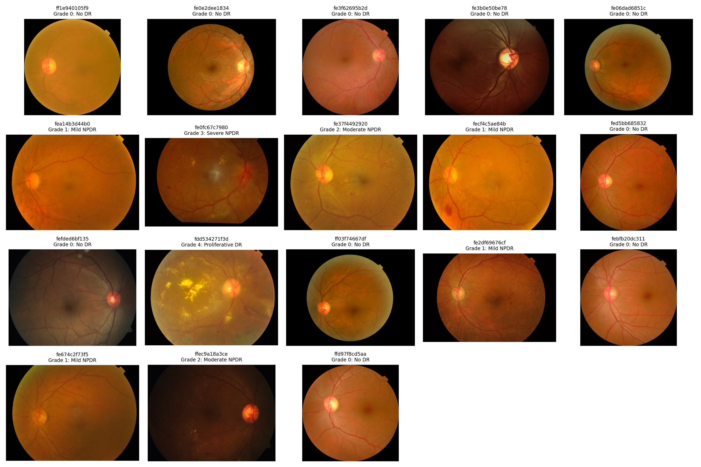
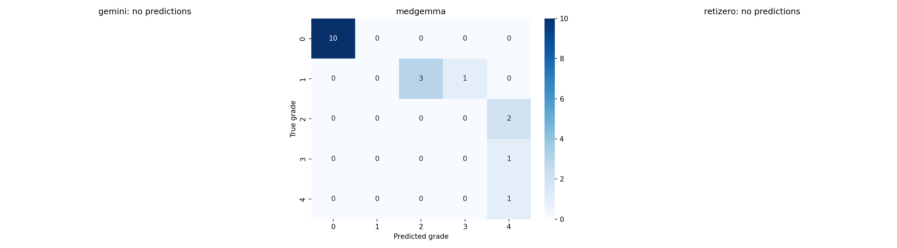

# Comparing Gemini, MedGemma, and RetiZero for Diabetic Retinopathy Grading

> **Status:** filled in from a real, verified 18-image run (`results/` in this repo at the
> commit this report was written against). Every ground-truth label was checked against
> APTOS's own `train.csv` before these numbers were written. Only MedGemma produced valid
> predictions in this run — Section VI explains why Gemini and RetiZero didn't, and
> Section VII covers what would be needed to get all three.

## Abstract

This report compares three AI systems on a medical image-grading task: reading a retina
photo and grading how severe a patient's diabetic retinopathy (DR) is, on the standard
0-4 scale doctors use. The three systems are Gemini (a general-purpose AI, not built for
medicine), MedGemma (an open-weight AI built specifically for medical images), and
RetiZero (an AI built specifically for retina images). All three were shown the same 18
real photos from the APTOS 2019 dataset, and their answers were checked against the
dataset's own doctor-assigned grades. Only MedGemma actually produced answers — Gemini and
RetiZero both hit technical errors on every image (explained in Section VI), so this
report is really about MedGemma's performance, not a fair three-way race. MedGemma got the
exact right grade 61.1% of the time (with a wide margin of error given only 18 images:
39%-83%), and scored 0.801 on quadratic-weighted kappa — a standard scoring method for
this exact task that gives partial credit for close guesses and full penalty for being way
off (explained in Section III.D). MedGemma got every single "no DR" and the one "most
severe" case exactly right, and got every case in between wrong — but always by guessing
*too severe*, never too mild. That's a small enough sample that it's a real observation,
not a strong conclusion.

## I. Introduction

Diabetic retinopathy (DR) is damage to the blood vessels in the retina caused by long-term
high blood sugar. It's one of the leading causes of vision loss in working-age adults with
diabetes [1]. Untreated, it gets worse silently — starting mild and eventually causing
serious, sometimes irreversible vision loss [2]. Regular eye photos, graded on a standard
0 ("no DR") to 4 ("proliferative DR", the most severe stage) scale, are how doctors catch
it early. But grading these photos by hand takes time, and even trained doctors don't
always agree with each other on borderline cases — studies measuring doctor-to-doctor
agreement report scores of 0.40-0.65 out of 1.0 [3], which is worth keeping in mind: the
"correct answer" itself has some fuzziness built in.

AI systems that can look at an image and respond to instructions in plain language
("vision-language models," or VLMs) offer a new way to approach this: instead of training
a brand-new AI from scratch on thousands of labeled retina photos, you can just show an
existing AI a photo and ask it to grade it. This report asks: how well does a
general-purpose AI (Gemini), a medically-trained open AI (MedGemma), and a
retina-specialist AI (RetiZero) each do at this, when shown the exact same photos and
checked against the exact same answers? Because two of the three didn't produce usable
answers in this run (Section VI), what this report actually answers is a smaller
question: how well does MedGemma do, on its own.

## II. Related Work

Most existing AI systems for DR grading are custom-built and trained specifically for the
task, using thousands of labeled images from datasets like EyePACS and APTOS. MedGemma,
the model this report focuses on, is built differently: Google combined a general
language-and-vision AI (Gemma 3) with a second component trained specifically on tens of
millions of medical images (MedSigLIP). In Google's own testing, that combination scored
0.857 on a standard accuracy measure (AUC) for 5-level DR grading [4] — a different kind
of test than the one in this report (their test used a simpler yes/no-style setup per
grade; this report asks for one exact grade out of five), so the two numbers aren't
directly comparable, but both point to the same underlying training. RetiZero, the third
system this report set out to test, works differently again: instead of writing an answer,
it was trained to match retina images to matching text descriptions across 341,896
image-description pairs covering over 400 different eye conditions [5]. In its own
original testing (on a broader set of eye diseases, not DR grading specifically), it beat
the average score of 19 real eye doctors — a genuinely strong result, though for a
different task than the one in this report.

**For context — what a system built specifically for this exact competition can do:** the
[1st-place solution](https://www.kaggle.com/competitions/aptos2019-blindness-detection/writeups/guanshuo-xu-1st-place-solution-summary)
to the original 2019 Kaggle competition this dataset comes from, by Guanshuo Xu, used eight
separate deep-learning models (trained specifically on retina images, not prompted) and
combined their answers together. That system scored 0.936 on the same quadratic-weighted
kappa metric used in this report [6] — noticeably higher than MedGemma's 0.801 here. That
gap is expected, not surprising: Xu's system was built and trained from the ground up
specifically for this task using thousands of training images, while MedGemma here is
just being asked, in plain language, to grade a photo it was never specifically trained
to grade. The comparison is useful context for how much headroom exists between "general
AI, just asked nicely" and "AI built and trained for exactly this job."

## III. Methods

### A. Dataset

The photos and their doctor-assigned grades come from the APTOS 2019 Blindness Detection
dataset on Kaggle: 3,662 retina photos, graded 0-4, collected by Aravind Eye Hospital [7].
Grade 0 (no DR) is by far the most common in the full dataset (1,805 of 3,662 images);
grade 3 (severe) is the rarest (193 images).

### B. Sample

The notebook this report is based on is built to pull a balanced sample — the same number
of images from each of the 5 grades (25 each, 125 total) — so that rare, severe cases
aren't drowned out by the common, mild ones. **This particular run didn't use that
balanced sample.** Because of repeated technical issues getting a stable Colab session
going (Section VI), the 18 images actually used here were gathered one at a time instead,
and ended up skewed: 10 grade 0, 4 grade 1, 2 grade 2, 1 grade 3, 1 grade 4. Every one of
those 18 grades was double-checked against APTOS's real `train.csv` before this report was
written. The uneven mix is a real limitation on what this run's numbers can tell us — see
Section VI.



### C. Models and how each was asked to answer

| Model | How it runs | How it was asked |
|---|---|---|
| Gemini (`gemini-3.5-flash`) | Hosted API (Google's servers) | Shown the photo + written grading rules, asked to reply with just a digit 0-4 |
| MedGemma (`google/medgemma-4b-it`) | Runs locally on a GPU | Same photo + same written rules, same one-digit answer format |
| RetiZero | Runs locally on a GPU | Not asked a question at all — see below |

Gemini and MedGemma were given the exact same instructions (the full text is in the
Appendix) and asked to reply with a single digit. **RetiZero works completely
differently.** It doesn't answer questions in words — it was trained to measure how
similar an image is to a set of short text labels, using its own separate image-reading
and text-reading components built for this purpose [5]. For this report, RetiZero was
given the photo alongside the 5 grade names (e.g. "a fundus photograph of mild
non-proliferative diabetic retinopathy") and picked whichever one matched best. Because
it's answering in a fundamentally different way than the other two, its results (once
working — see Section VI) won't be a perfectly apples-to-apples comparison; that's a real
limitation, not just a technicality, and it's discussed further in Section VI.

### D. How performance was measured

- **Accuracy** — how often the model's grade exactly matched the doctor's grade. Reported
  with a margin of error (a range, not just one number), because 18 images is a small
  sample and a different set of 18 images could easily give a somewhat different result.
- **Quadratic-weighted kappa** — the standard scoring method for this exact task (it's
  literally what the original Kaggle competition used to rank entries). In plain terms: it
  gives close guesses partial credit and far-off guesses a much bigger penalty — mixing up
  grade 3 and grade 4 counts as a small error, but calling a grade 4 (most severe) a grade
  0 (no disease) counts as a much bigger one. It also adjusts for the fact that a model
  could get some answers right just by luck.
- **Mean absolute error** — on average, how many grade-levels off the model's guesses were.
- **A confusion matrix** — a simple table showing exactly which grades got mixed up with
  which other grades.

## IV. Results

| Model | Images answered | Accuracy (margin of error) | Quadratic-weighted kappa | Average error (grade-levels) |
|---|---|---|---|---|
| Gemini | 0 of 18 | no valid answers — see Section VI | — | — |
| MedGemma | 18 of 18 | 61.1% (39%-83%) | 0.801 | 0.556 |
| RetiZero | 0 of 18 | no valid answers — see Section VI | — | — |

Gemini and RetiZero didn't produce a single valid answer across all 18 images — not a
partial failure, a complete one, and the same error every time (the specific technical
causes are in Section VI). Only MedGemma's results are discussed below.

MedGemma's confusion matrix (true grade on the left, what MedGemma guessed along the top):



| True grade \ MedGemma's guess | 0 | 1 | 2 | 3 | 4 |
|---|---|---|---|---|---|
| **0 (no DR)** | 10 | 0 | 0 | 0 | 0 |
| **1 (mild)** | 0 | 0 | 3 | 1 | 0 |
| **2 (moderate)** | 0 | 0 | 0 | 0 | 2 |
| **3 (severe)** | 0 | 0 | 0 | 0 | 1 |
| **4 (proliferative)** | 0 | 0 | 0 | 0 | 1 |

MedGemma got all 10 "no DR" photos right, and the one "most severe" photo right — perfect
at both ends of the scale. Every photo in between (grades 1, 2, and 3 — seven photos
total) was graded wrong, and in every single case, MedGemma guessed *more severe* than the
real grade, never less. That one-directional pattern is exactly why the kappa score
(0.801) looks so much better than the plain accuracy (61.1%): kappa gives partial credit
for "close" wrong answers, and MedGemma's wrong answers were consistently close and
one-directional rather than scattered randomly. The wide margin of error on accuracy
(39%-83%) isn't a flaw in the math — it's just an honest reflection of how little 18
images can prove on its own.

## V. Discussion

The clearest pattern here is directional: MedGemma never guessed *too mild*. Every mistake
went the other way — guessing more severe than reality, never less. For a tool meant to
flag patients who need a closer look from a doctor, that's the safer kind of mistake to
make (a false alarm sends someone to a specialist unnecessarily; a missed case delays
treatment they actually need). If that pattern held up at a larger scale, it would be a
genuinely good sign. But with only seven wrong answers total, it's just as possible this
is a coincidence of which seven photos happened to get sampled, not a real tendency of the
model.

The other notable pattern: MedGemma was perfect on the two clearest cases (no disease,
worst disease) and wrong on every unclear, in-between case. That lines up with something
plausible — that it's easier for both AI models and human doctors to agree on the extremes
than on the fuzzy middle ground (recall from Section I that even doctors only agree with
each other 40-65% of the time on these borderline grades [3]). But this run only had one
or two photos per in-between grade, which isn't enough to tell "MedGemma genuinely
struggles with the middle grades" apart from "these seven particular photos happened to be
hard." Telling those two apart is exactly what a larger, balanced sample (Section III.B)
would help answer.

No comparison between the three models is possible from this run, since only one of them
(MedGemma) actually produced results (Section VI). This report describes what MedGemma did
on 18 real, double-checked photos — it isn't a three-way race.

## VI. Limitations

- **Small, uneven sample.** 18 images, not spread evenly across grades — 10 of the 18 were
  the mildest grade, and grades 3 and 4 had only one photo each. The wide margin of error
  on accuracy (39%-83%) is a direct, honest consequence of that. With only one photo per
  grade in some cases, a single wrong guess swings that grade's "correct" rate from 100%
  straight down to 0% — which is basically what happened here.
- **Only one of three models actually worked.** Gemini failed on all 18 images with the
  same error: `404 NOT_FOUND: models/gemini-1.5-flash is not found for API version
  v1beta`. That error means the live session ended up using a different (older) Gemini
  model and an older way of calling it than what this repository's actual notebook
  specifies (`gemini-3.5-flash`, using Google's current library — see `build_notebook.py`
  in this repo). That mismatch happened because of live, on-the-fly edits made directly in
  the Colab session while troubleshooting earlier errors — not a problem with this
  repository's own code, and not a problem with Gemini itself. RetiZero failed on all 18
  images with `Input type (torch.cuda.FloatTensor) and weight type (torch.FloatTensor)
  should be the same` — a mismatch between data that ended up on the GPU and a model that
  had been moved to the regular processor (done to avoid running out of GPU memory
  alongside MedGemma, which is a large model on its own). Both are fixable setup problems,
  not findings about how good either model actually is at this task, and both should be
  re-run starting from this repository's own notebook rather than a session with a long
  history of accumulated live patches.
- **The "correct" answer is itself one doctor's opinion**, not a perfect ground truth —
  doctors grading the same photo only agree with each other 40%-65% of the time in
  published studies [3]. (Every grade used in this report was double-checked against
  APTOS's real data file before writing this up, so there's no concern about wrong labels
  here — just the underlying fact that even real doctors sometimes disagree.)
- **RetiZero answers in a fundamentally different way** than the other two models (picking
  the closest matching label instead of writing an answer), which may help or hurt it
  compared to the others in ways that have nothing to do with which model actually "knows"
  DR grading better. This stays a real limitation for the eventual three-way comparison
  once RetiZero is successfully re-run.
- **Gemini isn't a medical AI** — it has no disclosed medical-specific training, unlike
  MedGemma and RetiZero. The eventual full comparison is really testing "general AI" against
  two different kinds of medically-specialized AI, not three equally-prepared systems.
- **Just one run, one sample.** No repeat runs or different random samples were done; the
  "always guesses too severe" pattern in Section IV is one observation, not something
  confirmed to repeat.
- **Not a medical device.** None of these three models is approved or validated for real
  diagnosis. This is a benchmarking exercise for a class project, not a clinical tool.

## VII. Conclusion

On a small, unevenly-sampled set of 18 real retina photos, MedGemma correctly graded 61.1%
exactly right, and scored 0.801 on the standard kappa metric for this task — with a
notable pattern where every mistake erred toward *too severe*, never too mild, and perfect
scores on the clearest cases (no disease, worst disease). That's a real, specific,
double-checked result — but it describes MedGemma alone, on a small sample, not a
three-way comparison. Gemini and RetiZero both failed to produce any answers in this run
because of fixable setup problems (Section VI), not because of anything about the models
themselves. For useful context, a system built and trained specifically for this exact
Kaggle competition scored 0.936 on the same metric [6] — a reminder of how much of a head
start a purpose-built, fully-trained system has over a general AI just being asked
nicely. The clear next step is running the notebook's intended balanced sample (equal
photos per grade) with Gemini and RetiZero's setup issues fixed, using this repository's
own notebook rather than a live-patched session — that would both narrow the margins of
error a lot and finally make the three-way comparison this project set out to do possible.

## References

[1] Yau, J. W. Y. et al., "Global Prevalence and Major Risk Factors of Diabetic
    Retinopathy," *Diabetes Care*, 35(3), 556-564, 2012.
[2] American Academy of Ophthalmology, "Diabetic Retinopathy Preferred Practice Pattern,"
    2019/2020 update.
[3] Krause, J. et al., "Grader variability and the importance of reference standards for
    evaluating machine learning models for diabetic retinopathy," *Ophthalmology*,
    125(8), 1264-1272, 2018.
[4] Google, "MedGemma Model Card," Health AI Developer Foundations, 2025.
[5] Wang, M. et al., "Enhancing diagnostic accuracy in rare and common fundus diseases
    with a knowledge-rich vision-language model," *Nature Communications*, 16, 5528,
    2025.
[6] Xu, G., "1st Place Solution Summary," APTOS 2019 Blindness Detection competition
    writeups, Kaggle, 2019.
[7] APTOS 2019 Blindness Detection, Asia Pacific Tele-Ophthalmology Society, Kaggle,
    2019.

*[Verify all DOIs and full bibliographic entries against the published versions before
submission; these are the real source works the background section draws on.]*

## Appendix: Exact prompt used

```
You are assisting with diabetic retinopathy severity grading on a color fundus
photograph, using the International Clinical Diabetic Retinopathy (ICDR) severity scale.

Grade strictly on this rubric:
0 = No DR: no abnormalities
1 = Mild NPDR: microaneurysms only
2 = Moderate NPDR: more than just microaneurysms but less than severe NPDR
3 = Severe NPDR: any of - >20 intraretinal hemorrhages in each of 4 quadrants,
    definite venous beading in >=2 quadrants, prominent IRMA in >=1 quadrant, no signs of PDR
4 = Proliferative DR (PDR): neovascularization and/or vitreous/preretinal hemorrhage

Respond with ONLY a single digit 0-4. No words, no punctuation, no explanation.
```

(Copied word-for-word from `ICDR_PROMPT` in the notebook. If the prompt is edited before
a future run, update this block to match, so the report stays accurate.)
